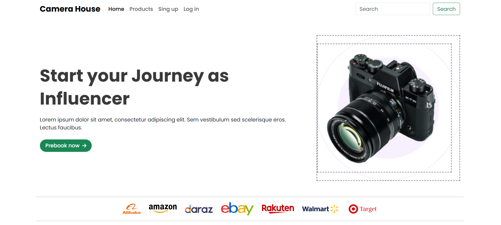
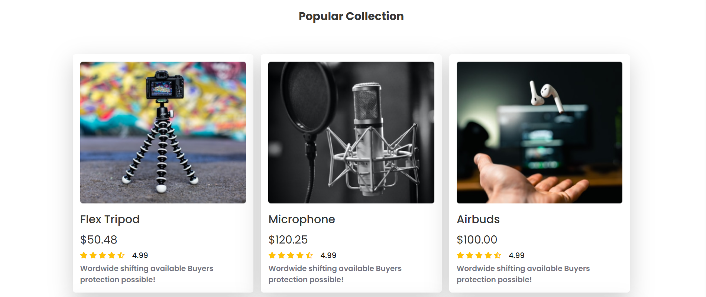
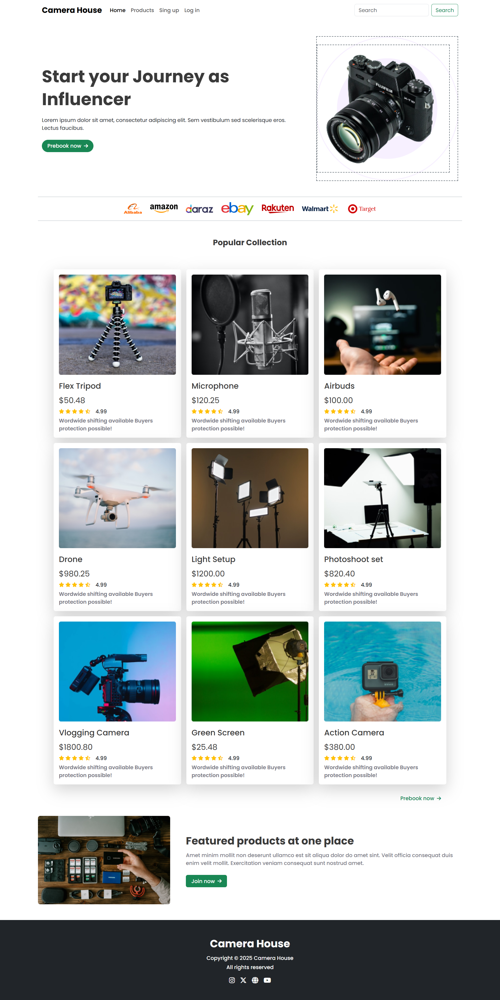

# 📸 Camera House — Responsive Landing Page

[🔗 Live Demo](https://camera-house.vercel.app/)

**Camera House** is a sleek, responsive landing page built to showcase **cameras** and **camera kits** such as lenses, lights, tripods, and more. Designed using **HTML**, **Bootstrap**, and **custom CSS**, this landing page adapts perfectly to all screen sizes and devices — from desktop to mobile.

---

## ✨ Features

- ✅ Clean, modern single-page layout
- ✅ Fully responsive across devices (mobile, tablet, desktop)
- ✅ Hero section with CTA (Call to Action)
- ✅ Product sections for cameras, lenses, lighting, tripods
- ✅ Custom CSS for overrides and styling where Bootstrap lacked flexibility
- ✅ Fast and lightweight performance
- ✅ Deployed on Vercel

---

## 🛠️ Tech Stack

| Technology   | Purpose                                         |
|--------------|-------------------------------------------------|
| HTML5        | Structure and content                           |
| Bootstrap 5  | Layout grid, responsiveness, and components     |
| CSS3         | Custom styling and UI enhancements              |
| Vercel       | Hosting and deployment platform                 |

---

## 📁 Folder Structure

```
camera-house/
├── assets/
│   ├── images/             # Product and banner images
│   └── logos/              # Logos and icons
├── css/
│   └── style.css           # Custom CSS styles
├── preview                 # Preview images
├── index.html              # Main landing page
└── README.md               # Project documentation
```

---

## 📸 Screenshots

### 🖼️ Hero Section


### 🖼️ Products Section


### 🖼️ Full Preview


---

## 🚀 Run Locally

To run this project on your computer:

1. **Clone the repository**
   ```bash
   git clone https://github.com/devo-ab/camera-house.git
   cd camera-house


# 👤 Author
# Avi Jit
## :mailbox: Reach me out
<p align="left">
<a href="https://linkedin.com/in/itsavijitb" target="blank"></a>
<a href="https://twitter.com/itsavijitb" target="blank"></a>
<a href="https://facebook.com/itsavijitb" target="blank"></a>
<a href="https://instagram.com/itsavijitb" target="blank"></a>
</p>